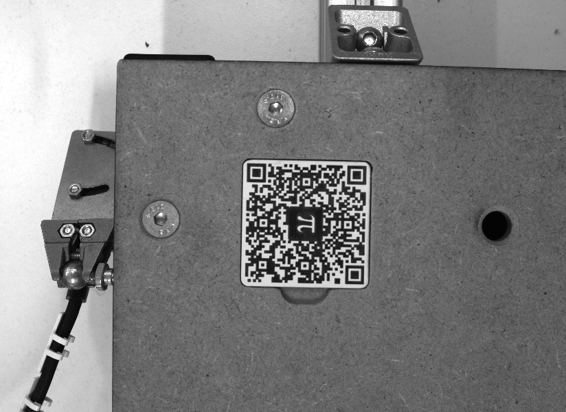
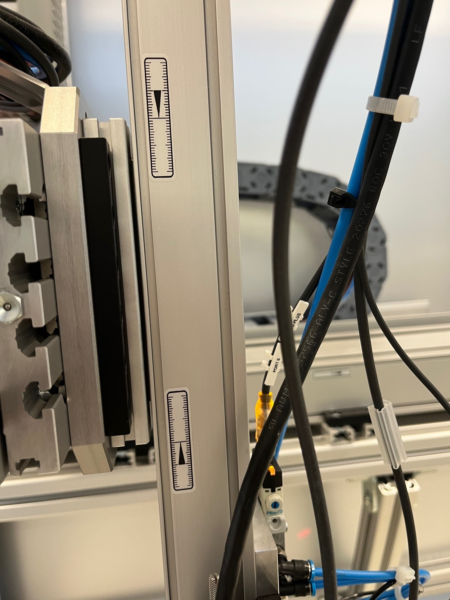
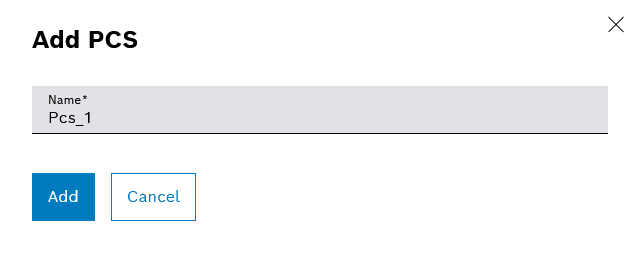
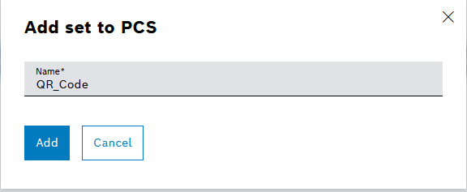
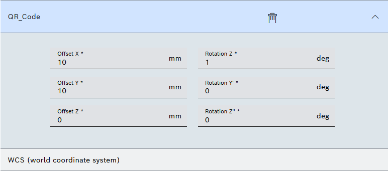
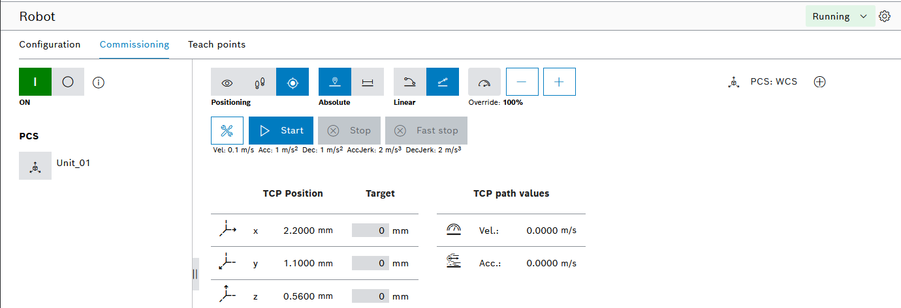
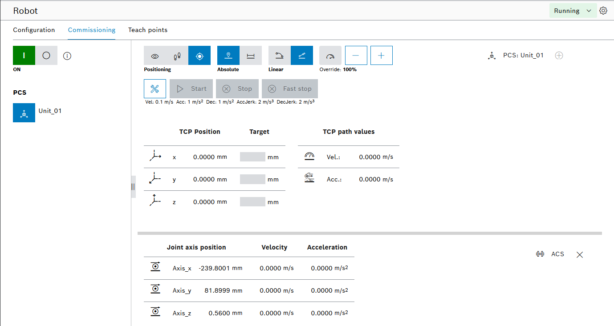
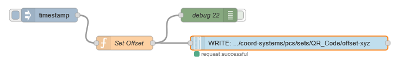

<h1 align="left">
  <br>
  
  <br> Advanced Automation Lab 02
  <br>
</h1>

Author: [Cédric Lenoir](mailto:cedric.lenoir@hevs.ch)


# Calibrate robot with QR Code

- On suppose que les positions des axes sont correctes.
- On suppose que la position du WCS est correcte.
- Les coordonnées WCS et MCS sont identiques.
- La différence entre MCS/WCS et ACS dépend de la direction des axes et de l'offset.
- On utilisera une PCS, Product Coordinate System pour ajuster plus précisément la position de la plaque de base qui peut légerement varier à l'aide du QR Code.

---

## Principle
### To draw the circle ⭕️, I:
- empirically identified the gripper's position at the central 80° x 80° position.
- arbitrarily lowered the camera's Z-axis to -50° to get some leeway in the QR code.
- identified the positions of the QR code's corners on the image.
- drew a circle ⭕️ that passes through the three vertices.

### To calibrate the system automatically, simply:
- place the camera at 80°, 80°, and -50° using $basePosition$.
- measure the QR code's position using $newPosition$.
- define PCS such that $pcs$ = $newPosition - basePosition$.

:bulb: PCS contains the X, Y, and Z offsets, as well as the rotation angles around the X, Y, and Z axes. For now, we are only working in three dimensions. The angle around the Z axis is possible because the parts to be placed are round. However, the option around the X and Y axes would require additional axes on the robot.

Ultimately, it's relatively simple.

---

## Configuration du robot, WCS.
- Axe X: Positive, offset -239.
- Axe Y: Negative, offset -82.
- Axe Z: Positive, offset 0.

### X: Offset = ACS – MCS (WCS)
- Example : Offset = -159 – 80 = -239
### y: Offset = -ACS (inverted)  – MCS
- Example: Offset =  -2 – 80 = -82


## Contrôle
- En mode Robot Kinematic activée, la position sur le nid central devrait être de:
- X: 80
- Y: 80
- Z: 0

> En position Z = 0, le capteur de distance U300_D50 devrait donner environ **300 mm**.

## Position de calibration
- La position WCS des axes pour lire le QR code devrait être de :
- X: 40
- Y: 90
- Z: -50
- Ouverture du diphragme de la caméra: 5.6

<div style="text-align: center;">
  <figure>
    
    <figcaption>QR Code with continuous upate</figcaption>
  </figure>
</div>

- Si nécessaire, ajuster la distance.


On ne va pas faire de calibration proprement dite, on va utiliser la position du QR code pour déterminer la position de la plaque par rapport au robot.

Une fois que cela sera fait on va utiliser la position du QR Code par rapport au robot pour
- Déterminer la position 0,0 du robot en 3D qui corresponde à la position.
- Déterminer l'angle qui correspond à l'orientation.

Utiliser ces valeurs avec les commandes de base 3D du robot.

# About Axis coordinate

<div style="text-align: center;">
  <figure>
    
    <figcaption>Coordinate system of a robot</figcaption>
  </figure>
</div>

> **ACS** for Axis Coordinate System. The position of the axes are set **in the drives**.

<div style="text-align: center;">
  <figure>
    
    <figcaption>Approximative zero of axis</figcaption>
  </figure>
</div>


# Comment configure le PCS
- Log in ctrlX-OS
- Select Motion - Coordinated Motion
- Select Product Coordinate Systems
- Switch PCS from Running to Configuration
- Add a PCS, for example: Unit_01

<div style="text-align: center;">
  <figure>
    
    <figcaption>Add a PCS: Unit_01</figcaption>
  </figure>
</div>

- Select Edit icon in Unit_01.
- Select button **+**.

<div style="text-align: center;">
  <figure>
    
    <figcaption>Add a set to PCS with name: QR_Code</figcaption>
  </figure>
</div>

With this set, you will add a specific offset for the QR code from the World Coordinate System.

<div style="text-align: center;">
  <figure>
    
    <figcaption>QR_Code is Set 1 from WCS</figcaption>
  </figure>
</div>

The World Coordinate System in ou system differs from the ACS, Axis Coordinate system with approximative offset with 


<div style="text-align: center;">
  <figure>
    
    <figcaption>Offset and rotation for QR Code</figcaption>
  </figure>
</div>

- Now Swich back from Configuration to Running.
- Select Coordinated Motion - Commissioning
- Now you can activate or deactivate the PCS when Robot is activated. Robot is activated with the green on/off button below.

<div style="text-align: center;">
  <figure>
    
    <figcaption>Robot Commissioning</figcaption>
  </figure>
</div>

- You can add a view with the + button add the up-right corner of the view.
- You can select variout views of coordinates.

<div style="text-align: center;">
  <figure>
    
    <figcaption>PCS with Unit_01 activated</figcaption>
  </figure>
</div>

> If the robot was a machining system, you could do various operations for as many parts on the plate by simply defining as many PCS as nest and selecting the PCS for each nest. **Advantage**: *the machining coordinates depends only of the operation, not of the position of the nest*.

## Accessing the PCS in the Data Layer

```js
motion/cfg/coord-systems/pcs/sets/QR_Code/offset-xyz
```

### Readind offset with Node-RED

<div style="text-align: center;">
  <figure>
    
    <figcaption>Reading PCS offset from Node-RED</figcaption>
  </figure>
</div>

```js
{"type":"ardouble","value":[0,1,5],"responseType":"read"}
```

### Writing offset from Node-RED

<div style="text-align: center;">
  <figure>
    
    <figcaption>Writing PCS offset from Node-RED</figcaption>
  </figure>
</div>

```js
// Set Offset function
var newmsg = {};

newmsg.payload = {"type":"ardouble",
                  "value":[0,1,5]};

return newmsg;
```