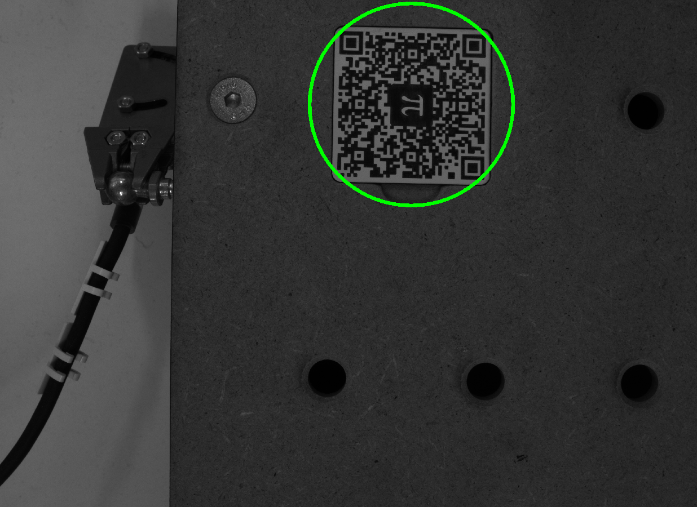
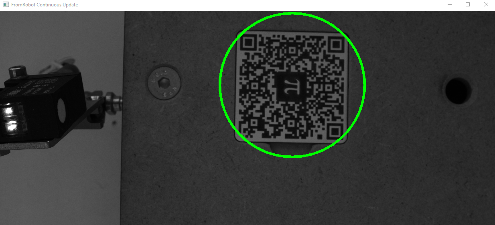

<h1 align="left">
   
  
    Robotics lab 2026.
   
</h1>

Author: [Cédric Lenoir](mailto:cedric.lenoir@hevs.ch)

## Empirical calibration
See Node Update Basler Circle. Start a continuous calibration 

1.  Set system in **Production** mode.
2.  Go in **Execute**.
3.  In 3D robot, Enable Kinematic.
4.  With Linear Move go to:
  x:  +85
  y:  78
  Z:  -25

5.  With X and Y, place the QR-Code in the middle of the circle.

|Axis|Target Position|Real QR code position|Computation|PCS-Offset|
|----|---------------|---------------------|-----------|----------|
|X   |**80**         |78 (your case)       |78-**80**  |-2         |
|Y   |**80**         |83 (your case)       |83-**80**  |3         |  
|Z   |**-80**        |-25 (your case)      |-25-(**-50**)|0         |

6.  Write values in Manual PCS Offset.
7.  Write manual Offset to PCS with button
8. Enable PCS

When you go with Linear Move in X:80, Y:80, Z:-50, the QR code should be in the middle of the circle

:warning: Should be possible to pick or place Test tube now.

X 80 and Y 80 is the position to take part in nest N°6, in the center.

    
    <figcaption>Camera when the gripper is on the center nest N°6 </figcaption>

> Another option is to modify directly offset for y and x axes in the axes of the robot.

## Python files for Node-RED

It is possible to run Python scripts using Node-RED.

See the folder Python.

For this project, the python scritps can be generated using Node-RED.

To be completed.

To use these functions.

The Basler drivers have to be installed on the PC with the camera.

## List of Python files

### NodeOneShotBasler.py
Take a one shot picture.

**Should be possible to start from Node-RED**

---

### NodeOneShotBaslerXYZ.py
To use this function, you need a folder with : ``./Documents/AutRob/imgRobot``
Take a picture and save the file with X,Y,Z coordinates of the robot.
Like : ``OneShot_13_41_54.jpg``

:warning: It works only if the python files has been started with Node-RED !

**Should be possible to start from Node-RED**

---

### NodeUpdateBaslerCircle.py
Take continuous pictures using the camera.

The image below with kinematic activated and 
- MCS X : **85**
- MCS Y : **78**
- MCS Z : **-25**

    
    <figcaption>Image for python file</figcaption>

**Should be possible to start from Node-RED**

---

### Node_QR_Code_Position.py
Un exemple qui retourne la position du QR code dans une image. La détection ne fonctionne pas toujours, dépend des conditions d'éclairage.

