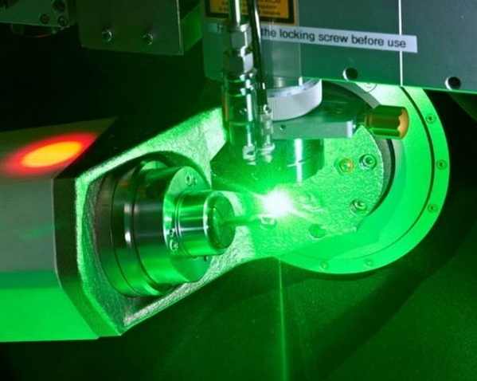

<h1 align="left">
  <br>
  
  <br> Robotics lab 2026.
  <br>
</h1>

Author: [Cédric Lenoir](mailto:cedric.lenoir@hevs.ch)


# AAut-rob_2026

## Version
CtrlX PLC 3.6.3

## Presentation of the lab

### Planning
#### Monday, April 20th.
-   $45min$ presentation of [Robot kinematic_functions](./Robot_Kinematic_Functions.md)
-   $45min$ Presentation of the subject, URS and soft description in manual mode.
-   $2 \times 45min$ hands on of existing software.
-   $2h$ per person, at home preparation of **FS**, **OQ**, **DS**, **IQ** documents.

#### Monday, April 27th.
-   $3 \times 45min$ implementation and tests **FS** + **OP**.
-   $45min$ demo and performance qualification.
-   $2h$ per person, at home Finalizing the report.

---

### Robot kinematic functions

Understanding the concept of dynamic assembly of a kinematic.

<div align="center">
    
    <figcaption>Synova's Laser MicroJet® systems</figcaption>         
</div>

Understanding the concept of position calibration includes:
- The zero point of the axes relative to the **ACS** motors.
- The zero point of the axes relative to the machine, **MCS** or **WCS**.
- The zero point relative to the product, **PCS**.

- The machine is not complete; the transition from ACS to PCS needs to be completed, and the kinematics need to be synchronized using the appropriate PackML states.

- You must explain in a **Functional Specification**, **FS**, how you will do this and how you will verify its **Operational Qualification**, **OQ**, Approximately one page of each, see example of **URS** and **PQ**.

- You must provide the class diagrams necessary for understanding your architecture and implement it, **Design Specification**, **DS**, two pages.

- Test your code on one page, **Installation Qualification**, **IQ**, primarily to ensure the positioning is correct.

URS and PQ are given, I have to print them for you.

To simplify somewhat, you need to automate what I do manually. The presentation is done in live during the presentation of the lab.

---

## Annexes

## List of document in this repo.

- [Basics for Robot Kinematics Functions](Robot_Kinematic_Functions.md
- [More about PCS with Node-RED](About_PCS.md). Explain how to access PCS in the datalayer from Node-RED.
- [Calibrate robot with QR Code](./How_To_Calibrate_Robot_with_QR_Code.md). Explain the process of principle of the calibration using the QR code on the plate.
- [Bug report](BugToBeSolved.md). A serie of bugs or knowl problems.
- [Calibration Version Beta du 29 octobre](Calibration%20Version%20Beta%20du%2029%20octobre.docx) **Attention document Word**, mais état avant de laisser tomber pour passer à autre chose...
- [Python files for Node-RED](PythonFilesForNodeRed.md) some examples of files to take images and calibrate the system.

---

## Work in program for futur use

This work is in progress, started on october 9, 2025.

-   Based on AAut-lab-03_2026
-   Added 3D robot from **2025** [AAut-lab-03-2025](https://gitlab.hevs.ch/infrastructure/labos/automation-box/s6-auta-advanced-automation/aaut-lab-03_2025).
-   Added Camera from [CtrlX Core Basler Calibration](https://gitlab.hevs.ch/infrastructure/labos/automation-box/technicalreviews/ctrlx_basler_calibration).

## About kinematic
[See kinematic functions](./Robot_Kinematic_Functions).

## Access to kinematic via datalayer
[See about PCS](./About_PCS.md).

## Next step
-   When completed, it should be possible to calibrate the position of the camera using the QR Code HEVS.


# Technically speaking
-   The motions from Node-RED to the robot are sent via methods.
-       Methods include positions in X,Y,Z, velocity, acceleration and jerk.
-       Methods include Pick with nest number
-       Methods inclue Place with nest number
-       Methods include check test tube.
-       Methods include get image.


# Point de la situation au 8 octobre.

## Robot avec camera.
Debug: when started first time, does not work.

<span style="color:red; font-weight: bold;">Warning</span>
If you start Node-RED from the Git folder, **the path for the files will be into this folder**.
That's why you need an absolute path with your name.

> Tip: The filename should be an absolute path, otherwise it will be relative to the working directory of the Node-RED process.

do not use: .\Documents\AutRob\NodeOneShotBasler.py
use 

and to execute python file: python C:\Users\cedric.lenoir/Documents/AutRob/NodeOneShotBasler.py -u

<span style="color:red; font-weight: bold;">Il faudra trouver une méthode plus élégante</span>
With that ? https://www.docker.com/blog/resources-to-use-javascript-python-java-and-go-with-docker/


Be carefull with that:

### Node Red Flows for Camera
Do not forget that you need the Basler Camera package to be installed to use it.
-   Axes Positions written in global Flow are here: flowPosition.json
-   Node-Red to Python connexion flow is here: flowsToPython


```js
let X_Position = global.get('X_Position');
let Y_Position = global.get('Y_Position');
let Z_Position = global.get('Z_Position');

let buildPayload = ' ' + X_Position + ' ' + Y_Position + ' ' + Z_Position;

msg.payload = buildPayload;

return msg;
```

---

# Distance of camera for QR code.
There is a sensor Baumer U300 D50. You can check it on the TP 700 Simatic HMI.
If the quality bit is green, that means wrong. Adapt the threshold with Baumer Sensor Suite.
You should use the camera with:
-   Distance of sensor about 250 mm
-   Réglage de l'ouverture de la caméra: **F 5.6**, bague du bas.
-   Réglage de la distance de la caméraa: environ 2, ajuster si nécessaire.
-   Mesure distance objectif environ 200 mm


> Pour une image nette avec un arrière-plan flou (portraits), utilisez une grande ouverture (petit nombre f/ comme f/2.8), tandis qu'un paysage (tout net) nécessite une petite ouverture (grand nombre f/ comme f/11). L'ouverture contrôle la quantité de lumière et la profondeur de champ, l'ouverture étant le trou du diaphragme qui s'ouvre pour laisser passer la lumière vers le capteur. 

---

## About PCS

[More about PCS](./About_PCS.md)

<!-- End of file>