<h1 align="left">
   
  
    Advanced Automation / Robotic
   
</h1>

Author: [Cédric Lenoir](mailto:cedric.lenoir@hevs.ch)

# kinematic functions of the robot

**Version**
CtrlX PLC 3.6.3

**Preamble**
This project is a mix between Advanced automation and Robotics.

## Basics
We use the Motion App, Motion Runtime Environment for ctrlX Core version 3.
This runtime is not a robotic environment.

This is an environment that allows you to develop your own robotic system or multi-axis CNC machine.

We will cover some basic concepts.

The goal is to highlight some notions that illustrate the complexity involved in commissioning a complete system, not from a turnkey robot, but from a system composed of elementary axes.

Some coordinate concepts have probably been covered in the robotics course; here we recall those that are necessary to put them into practice.

:bulb: The details of kinematic transformation are out the scope of this environment. That is, a set available kinematics, most of them are **under license**. *In the HEVS lab, we have licenses for cartesian kinematics + 1 axis.*

**Standard transformations available out of the box.**

    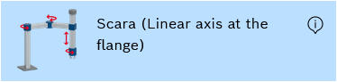
    <figcaption>Scara</figcaption>

    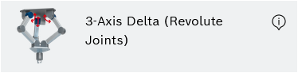
    <figcaption>Delta</figcaption>

    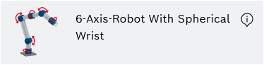
    <figcaption>6 Axis Robot With Spherical Wrist</figcaption>

    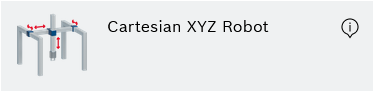
    <figcaption>Cartesian XYZ Robot</figcaption>

**Some transformations require specific development.**

    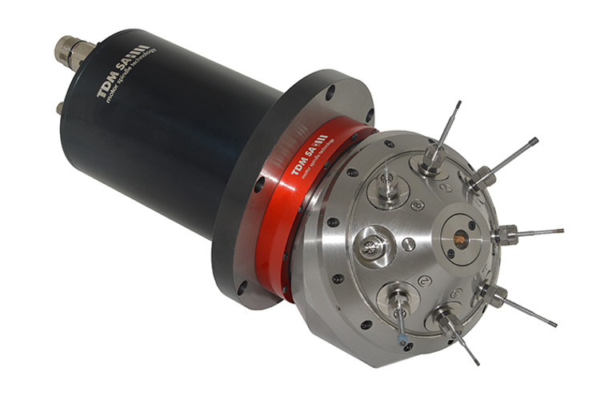
    <figcaption>TDM Multi-Tools Spindle</figcaption>

## Kinematic functions
### Position and orientation in space
For most machining processes, it is necessary to move a tool to different positions, or if required, to move the tool along a defined path. Examples include pick-and-place applications or a welding process on a component. In addition to specifying a target position, an orientation can also be defined for the motion. This is required for a process such as gluing in order to move along a path in space so that the tool is at a certain angle to the workpiece to be processed. The combination of position and orientation is referred to as a pose in space. The following section explains how the required positions can be defined in different coordinate systems before going into more detail on orientations.

#### Coordinate systems
A Cartesian coordinate system is usually used for positions in space. This consists of three mutually perpendicular axes, whereby the position is specified by the distance to the origin of the axes in the x, y and z directions. These distances px, py and pz are shown as dashed lines in the image below.

    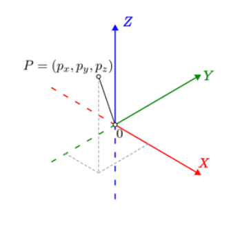

Different Cartesian coordinate systems can be used in space, which differ in
the position of their origin or the direction of the axes. When describing a
point, it is therefore always important to specify which coordinate system is referred to. In ctrlX CORE, it is distinguished between the following coordinate systems:

    
    <figcaption>Robot Coordinate System</figcaption>         

You can select between :

| Name | Initial | Comment |
|------|---------|---------|
| MCS | | machine coordinate system |
| WCS | | world coordinate system |
| PCS | | product coordinate system |
| ACS | :o: | axis coordinate system |

#### Axis Coordinate System, ACS.
This refers to the position of each element independently of the others.

Since the HEVS laboratory units are used for many practical exercises, we set the zero position of each axis by default to approximately the center of the ball screw.

    
    <figcaption>For example, zero of the Z_Axis</figcaption>         

#### World Coordinate System, WCS
Not used in our case. A typical use case would be when several robots need to share a common reference point in a factory floor. In the HEVS lab, by default, **WCS = MCS**.

#### Machine Coordinate System, MCS
The machine coordinate system, MCS, is permanently connected to the base
of the machine. In the case of a robot, for example, this would be the base of a robot, whereby the z-axis of the MCS often corresponds to the first rotary axis.

#### MCS commissioning

In the case of the automation lab, we define the 0 of the MCS when the camera is approximately above the QR code.

    
    <figcaption>Camera above the QR code.</figcaption>         

We keep the zero of the z axis in MCS at the same value than for ACS.
When commissioning the XYZ kinematic 

    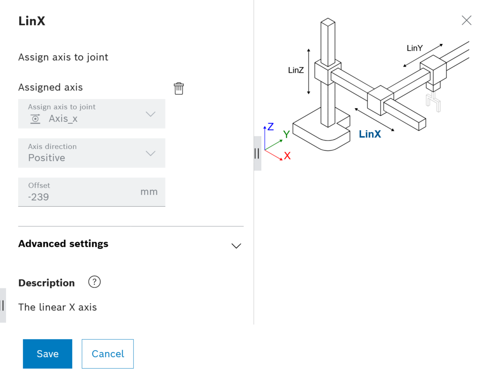
    <figcaption>Linear X axis positive, -239</figcaption>         

:bulb: The direction of the y axis depends of the Unit, **left or right**.

    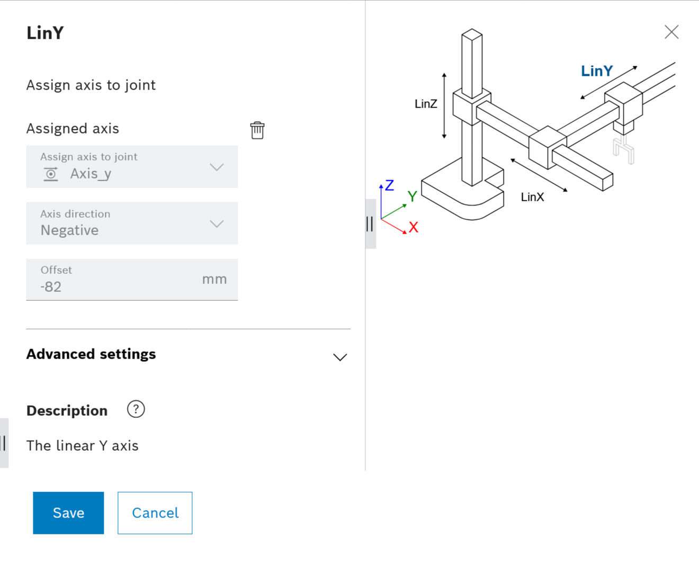
    <figcaption>Linear Y axis negative, -82</figcaption>         

:bulb: Axis refers to the mechanical axis, the ball screw. The rotary transformation from the rotary motor to the linear axis is done inside the drive.

#### Finally
After configuration of the robot and activation of the kinematic, we have a robot that moves approximatively from the corner where is the QR code with position MCS x=0 and y=0 to the opposite corner of the plate with positive X and Y coordinates.

    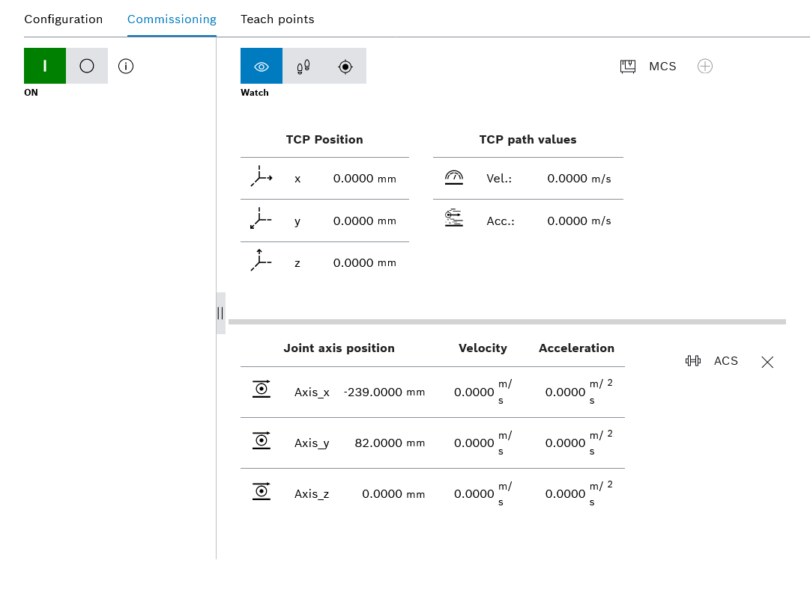
    <figcaption>MCS versus ACS</figcaption>         

***next ?***
Above, we have written **approximatively**, we have to remove this word with :warning: **precisely**.

---

### Product Coordinate System, PCS
It is possible to define several product coordinate systems, PCS. Examples of this would be a machining table or the workpiece to be machined. This allows points or paths to be defined relative to a workpiece or table, facilitating changes to the setup. For example, after moving a workpiece, the position of the PCS would simply have to be updated instead of having to recalculate or redefine all paths. Common designations in other control systems are workpiece, object or program coordinate system.

A PCS is defined by an OffsetXYZ, a rotation and an offset for auxiliary axes and is saved as set.
-   Several sets, acting together can be linked.
-   All sets and groups are addressed by names. The values are saved in the configuration of the kinematics.
-   As long as a PCS is enabled, all subsequent motion commands are traversed  in this coordinate system.
-   If an offset is required for a single axis motion, a separate kinematics should be created containing only the single axis.

    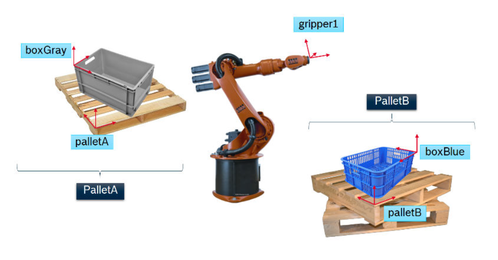
    <figcaption>PCS Basics</figcaption>         

**Naming**
MCS: Machine coordinate system
PCS: Product coordinate system
**Set**
A set contains offsets and orientation parameters describing a **PCS**:
-   3 offset values for axes with the geometric significance X, Y, Z
-   3 orientation parameter, Euler angle, describing the PCS orientation
Examples of a set
-   Set, **palettA**, for position and orientation of a pallet
-   Set, **boxGray**, for position and orientation of a box
-   Set, **gripper1**, for gripper description (size and orientation).
**Group**
Defines a PCS set sequence acting together; e.g. a box is positioned on a
pallet.
-   Set **palletA** defines the position and orientation of the pallet
-   Set **boxGray** defines the position and orientation of the box on the pallet
-   Both sets form the **PalletA** group.

#### Concretly
:bulb: **For this lab**, the goal is to define the PCS transformation that modify the approximate MCS coordinate system with the camera above the QR-Code to the PCS-1/QR_Code

    
    <figcaption>Set for QR_Code offset and rotation</figcaption>         

In this system about all configurations can be made using PLC, or other commands via the datalayer. In fact, when we open the browser to configure some data, that is no more else than html commands.

    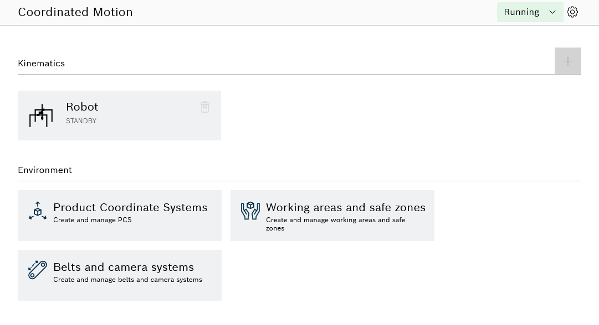
    <figcaption>Configure a PCS Group and a QR_code Set.</figcaption>         

 

:bulb: enter the ctrlX core system with login and password, then
-   Motion, Coordinated-Motion, select Product Coordinated Systems.
-   Open the door of the cell then switch PCS to Configuration in the upper left corner.
-   Add PCS, **Pcs_1**.

    
    <figcaption>Configure a PCS Group Pcs_1.</figcaption>         

-   Add a set to Pcs_1 group, **QR_Code**.

    
    <figcaption>Configure a set QR_Code in Pcs_1.</figcaption>         

:bulb: Please keep the names **Pcs_1** and **QR_Code**, because the path is used to display these PCS in the Node-RED UI.

:bulb: The PCS refers to the WCS, but in our case, WCS and MCS have the same reference point.

You could add many sets of PCS sets the select or unselect them during runtime via the datalayer.

    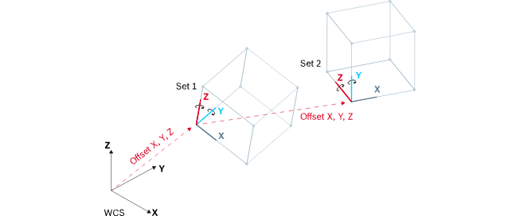
    <figcaption>It is possible to configure many sets..</figcaption>         

### End of introduction
In this lab, we will:
-   Start the kinematic at runtime.
-   Modifiy the parameters of the PCS QR_Code.
-   Activate or deactivate the PCS on runtime.

:bulb: For this lab, most of the motion configurations are done from Node-RED thru the datalayer. That is the next step.

---

## As a machine builder
If you want to have a more complete of what is possible with a modern motion app, out of the box, you could have a look on the [documentation provided in this repository, motion app version 3](./documentation/R911423405_01_Motion%20App%20Version%203,%20Application%20Manual_EN.pdf).

### Managing a robot for a conveyor
The **belt-synchronous** command option enables a kinematic motion that is synchronous to an assembly or conveyor belt in terms of position and orientation. The belt can be moved forwards or backwards as required, change its velocity or stop.

    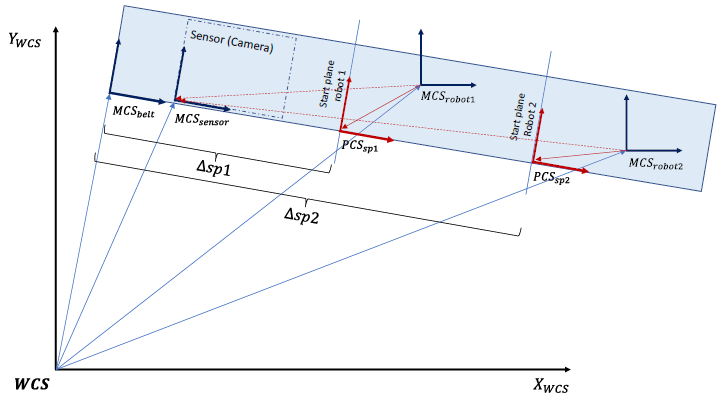
    <figcaption>In this case, MCS is dynamic</figcaption>         

### Managing various grippers

An application can use different tools of different size/rotation. All specified motions refer to the TCP, tool center point. The different tools are responsible for different axis motions, taken into consideration by the different offsets.

    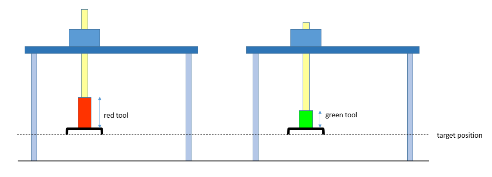
    <figcaption>PCS tool offset</figcaption>         

<!-- End of file>